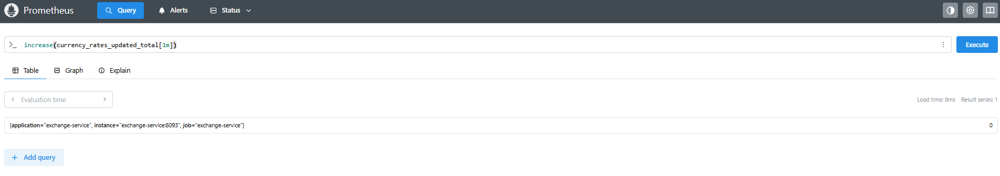
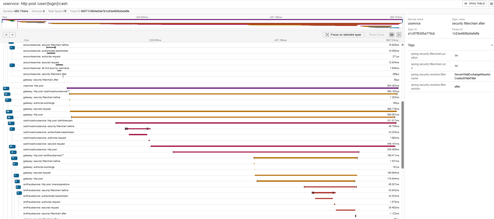
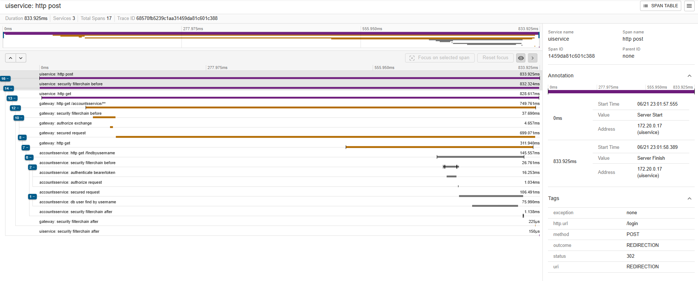
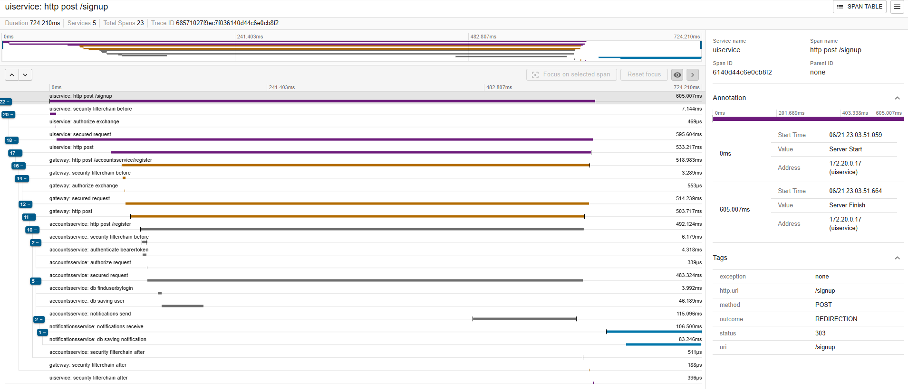

# 🏦 Банковское Микросервисное Приложение

## Spring Boot-приложение, реализующее банковскую систему с использованием микросервисной архитектуры. 
Включает в себя регистрацию пользователей, управление счетами, переводы, валютные курсы, уведомления и другие функции.
Приложение предоставляет пользовательский интерфейс, через который пользователи могут использовать банковское приложение, им доступны следующие функции:
* Редактирование личных данных, смена пароля, регистрация, авторизация
* Снятие денег со счета и зачисление наличных на счет (эмуляция банкомата)
* Переводы другим пользователям и себе
* Конвертация валют, переводы на счета в других валютах
* Отслеживание курсов валют, изменяемых в реальном времени
* Закрытие и открытие счетов в разных валютах
* Приложение защищено авторизацией и аутентификацией
* Поддерживается безопасность, проверка переводов антимошенническим сервисом Antifraud
* Приложение поддерживает запуск в различных средах - с помощью Helm + Kubernetes (ниже приведена инструкция по развертыванию) и отладочный с помощью docker.compose
* Приложение логирует действия пользователя в отдельной базе данных с помощью сервиса Notifications.
* Сервис Notifications использует Apache Kafka для чтения уведомлений из топика Kafka как consumer, сервисы-клиенты используют kafka producer для отправки уведомлений в топики
* Сервис обмена валют использует Kafka для чтения курсов валют из топика Kafka, напротив, сервис генерации валют использует Kafka Producer для отпраки сгенерированных курсов валют в топик Kafka

## Используемые технологии и реализуемые паттерны
* Код приложения написан на Java 21
* Микросервисы приложения собираются как многомодульный проект с помощью системы сборки Gradle
* UI приложения использует технологию WebFlux для осуществления асинхронных запросов в микросервисы
* Часть сервисов использует блокирующий стек Spring Web, другая часть - реактивный Spring WebFlux
* Сервисы, взаимодействующие с базой данных, используют PostgreSQL + Hibernate ORM + Liquibase
* Базы данных каждого из микросервисов разделены на уровне схем
* Сервисы общаются с помощью единого Gateway API (Spring Cloud Gateway), реализованного как отдельный микросервис. Gateway опирается на сервер Eureka, который собирает и хранит данные об адресах и количествах экземпляров каждого из микросервисов. Таким образом, Gateway без перезапуска может подхватывать новые зарегистрированные сервисы, их можно перезагружать без остановки приложения. Eureka используется как имплементация паттерна Service Discovery
* Реализован паттерн Externalized/Distributed Config с использованием Spring Cloud Config - каждый из микросервисов получает свою конфигурацию с сервера конфигураций, который хранит в своих директориях эти конфигурации.
* В качестве сервера авторизации выбран сервис KeyCloack, запускаемый в отдельном контейнере. Gateway обращается в этот сервис для получения токена, с которым он обращается в защищенные сервисы. Без этого токена Json Web Token сервисы отклоняют запросы со статусом 403.
* Приложение покрыто Unit и интеграционными тестами,  а также реализованы контрактные тесты Spring Cloud Contract, запускаемые автоматически при сборке проекта
* JAR файлы каждого из подмодулей запускаются в отдельных Docker-контейнерах в рамках общей Docker network. Реализован паттерн Single Service Per Host
* Для генерации UI-форм используется шаблонизатор Thymeleaf. 
* Используются AJAX-запросы из JavaScript для получения данных с сервера
* MapStruct использован для преобразования DTO в сущности приложения
* Mockito, JUnit, MockMVC - технологии для тестирования
* Тестовые конфигурации отделены от производственных (Production)
* Реализован Helm chart для быстрого и удобного развертывания приложения с помощью Kubernetes
* Паттерн Externalized Distributed Config реализован как с помощью Spring Cloud Server (при запуске через Docker Compose), так и через механизм ConfigMaps Kubernetes
* Service Discovery при запуске через Kubernetes реализован с помощью механизма Ingress с реализацией Nginx
* Используется Apache Kafka для асинхронного обмена сообщениями при отправке уведомлений и генерации курсов валют

##  Функциональные микросервисы

1. **UI service** — Пользовательский интерфейс приложения, доступный в браузере.
2. **Notifications service** — Сервис уведомлений - записывает важные действия пользователей в БД аудита.
3. **Currency Exchange service** — Сервис конвертации курсов валют.
3. **Accounts service** — Критический сервис. Отвечает за зачисления денег, открытие и удаление счетов, управление данными пользователей
3. **CashInCashOut service** — Пополнение и снятие.
4. **Transfer service** — Предназначен для переводов между счетами.
6. **Currency Exchange Generator service** — Сервис, который по расписанию генерирует курсы валют и отправляет в сервис конвертации.
7. **Antifraud** — Сервис блокировки мошеннических операций.

## Инфраструктурные микросервисы

1. **Gateway** — Spring Cloud Gateway - шлюз, через который все сервисы обращаются друг к другу. Авторизуется с помощью KeyCloak.
2. **Eureka Service Discovery** — Сервис обнаружения и учета других сервисов - не используется при запуске через Kubernetes
3. **Config Server** — Сервис хранения конфигураций для всех микросервисов приложения - не используется при запуске через Kubernetes

## Развертывание и запуск через Docker Compose
1. Необходимо клонировать репозиторий:
```bash
   git clone https://github.com/medasumumbs/MicroservicesBankApplication.git
```
2. В корне директории запустить команду для сборки 
```bash
   gradlew.bat build
```
3. Для тестирования отдельно может быть запущена команда
```bash
   gradlew.bat test
```
4. Cборка и тестирование отдельных модулей соответственно:
```bash
   gradlew.bat -p <наименованиеПодмодуля> <build/test>
```
5. Запуск приложения через Docker (Docker Engine обязательно должен быть установлен на локальной машине):
```bash
   docker-compose up --build -d
```
6. По этому адресу будет доступен личный кабинет пользователя после аутентификации: 
```
http://localhost:8087/
```
7. Мониторинг Kafka может быть осуществлен с помощью Kafka UI по следующему URL:
```
http://localhost:8072/
```

## Развертывание и запуск через Kubernetes + Helm
1. Необходимо клонировать репозиторий:
```bash
   git clone https://github.com/medasumumbs/MicroservicesBankApplication.git
```
2. В корне директории запустить команду для сборки
```bash
   gradlew.bat build
```
3. Запуск кластера Minikube
```bash
   minikube start
   minikube addons enable ingress
   minikube config set memory 16384
   minikube stop
   minikube start
```
4. Minikube необходимо привязать к текущему окружению Docker (PowerShell):
```bash
   $dockerEnv = minikube docker-env --shell powershell
   Invoke-Expression ($dockerEnv -join "; ")
```
5. Cборка отдельных Docker-образов:
```bash
    docker build -t accounts-service:0.0.1-SNAPSHOT ./accounts_service
    docker build -t antifraud-service:0.0.1-SNAPSHOT ./antifraud_service
    docker build -t cash-in-cash-out-service:0.0.1-SNAPSHOT ./cash_in_cash_out_service
    docker build -t currency-exchange-service:0.0.1-SNAPSHOT ./currency_exchange_service
    docker build -t exchange-generator-service:0.0.1-SNAPSHOT ./exchange_generator_service
    docker build -t gateway-service:0.0.1-SNAPSHOT ./gateway   
    docker build -t notifications-service:0.0.1-SNAPSHOT ./notifications_service
    docker build -t transfer-service:0.0.1-SNAPSHOT ./transfer_service
    docker build -t ui-service:0.0.1-SNAPSHOT ./ui_service
```
6. Обновление зависимостей для Helm-чарта:
```bash
   cd ./bank-helm-chart
   helm dependency update .
```
7. Запуск приложения и открытие порта:
```bash
   helm install myapp ./
   kubectl port-forward svc/ui-service 8080:80 -n default
```
8. По этому адресу будет доступен личный кабинет пользователя после аутентификации:
```
http://localhost:8080/
```
9. Приблизительно через пять минут, когда стартовали все сервисы, появляется возможность запустить Helm-тестирование:
```bash
   helm test myapp
```

* Приложение поддерживает CI CD Pipeline в среде Jenkins:

Для запуска Jenkins необходимо предварительно создать файл .env в директории Jenkins'а:
```dotenv
KUBECONFIG_PATH=<....>\.kube\config.yaml
GITHUB_USERNAME=<Ваш Login на github>
GITHUB_TOKEN=ghp_{токен для авторизации github}
GHCR_TOKEN=ghp_{токен для авторизации в Github container registry}

# Docker registry (Github container registry)
DOCKER_REGISTRY=ghcr.io/<Имя пользователя>
GITHUB_REPOSITORY=medasumumbs/MicroservicesBankApplication

DB_PASSWORD=<пароль к БД>
```
Затем необходимо запустить Jenkins:
```bash
cd jenkins
docker compose up -d --build
```
Jenkins будет доступен на локальной машине на порту 8080.

Управление пайплайном может быть осуществлено в нативном интерфейсе Jenkins.

Для очистки созданных во время пайплайна ресурсов и приложений может быть использована команда
```bash
./nuke-all.sh
```

Локальный запуск Kafka вне Docker требует добавления DNS: 
127.0.0.1 myapp.kafka.ru

*Инструкция по мониторингу при запуске в Docker Compose*

Prometheus - программа, позволяющая агрегировать и собирать метрики приложения:
1) Бизнес-метрики, характерные для логики приложения
2) Метрики Java-машины (утилизация памяти, потоки и т.д.)
3) Метрики HTTP-запросов (статусы, время обработки)

Prometheus доступен по адресу:
http://localhost:9090/query

Во вкладке Query можно просматривать непосредственно метрики, выполняя запросы к базе метрик:




*Полезные команды для просмотра метрик в Prometheus:*
* sum(login_total{login="<логин пользователя>", status="<success или failure>"}) // Позволяет просматривать количество успешных или неуспешных попыток логина в разрезе отдельного пользователя
* sum(transfer_total{status="<success/failure>", login="<логин инициатора платежа>", recipientAccount="<id счета получателя>", senderAccount="<id счета плательщика>"}) // Получение количества успешных/неуспешных переводов в разрезе инициатора платежа, номера счета плательщика и номера счета получателя
* sum(operationBlocked_total{login="<Логин пользователя - инициатора операции>", recipientAccount="<id счета получателя/'NONE' для снятия денег/login_currencyCode для внесения денег>", senderAccount="<id счета отправителя/'NONE' для внесения денег/login_currencyCode для снятия денег>"}) // Мониторинг заблокированных операций в разрезе инициатора/номера счета отправителя/номера счета получателя // Мониторинг заблокированных операций в разрезе инициатора/номера счета отправителя/номера счета получателя
* sum(failedToSendNotification_total{login="<логин пользователя>"}) // Неудачные попытки отправки уведомлений в Kafka.
* sum(currency_rates_updated_total) // Количество обновлений справочника валют. Если оно не растет в течение длительного времени - необходимо диагностировать проблему.

///TODO Расписать логику алертов, какие реализованы

Трассирование - возможность проследить путь запроса через все микросервисы, БД и Kafka, зная лишь TraceId конкретной сессии

Zipkin доступен для просмотра трассировок по URL:
http://localhost:9411/zipkin/

Примеры трассировок
* Трассировка зачисления денег на счёт:

* Трассировка некорректной аутентификации

* Трассировка регистрации пользователя


///TODO Расписать Prometheus, расписать ELK-стек, расписать Kubernetes